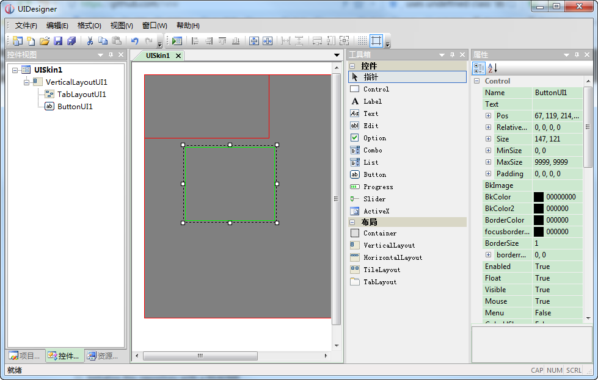

UIDesigner的原理

1、HOOKAPI

```c

CHookAPI::CHookAPI(void)
{
#ifdef _DEBUG
	CreateFileAPI=(pfnCreateFile)HookAPI(_T("KERNEL32.dll"),LPCSTR("CreateFileW"),(FARPROC)Hook_CreateFile,GetModuleHandle(_T("Duilib_ud.dll")));
	EnableCreateFile(true);

	HookAPI(_T("Duilib_ud.dll"),LPCSTR("?Invalidate@CPaintManagerUI@DuiLib@@QAEXAAUtagRECT@@@Z"),(FARPROC)Hook_Invalidate,m_InvalidateHookInfo);
	EnableInvalidate(true);

	HookAPI(_T("Duilib_ud.dll"),LPCSTR("?GetImageEx@CPaintManagerUI@DuiLib@@QAEPAUtagTImageInfo@2@PB_W0K@Z"),(FARPROC)Hook_GetImageEx,m_GetImageExHookInfo);
	EnableGetImageEx(true);
#else
	CreateFileAPI=(pfnCreateFile)HookAPI(_T("KERNEL32.dll"),LPCSTR("CreateFileW"),(FARPROC)Hook_CreateFile,GetModuleHandle(_T("Duilib_u.dll")));
	EnableCreateFile(true);

	HookAPI(_T("Duilib_u.dll"),LPCSTR("?Invalidate@CPaintManagerUI@DuiLib@@QAEXAAUtagRECT@@@Z"),(FARPROC)Hook_Invalidate,m_InvalidateHookInfo);
	EnableInvalidate(true);

	HookAPI(_T("Duilib_u.dll"),LPCSTR("?GetImageEx@CPaintManagerUI@DuiLib@@QAEPAUtagTImageInfo@2@PB_W0K@Z"),(FARPROC)Hook_GetImageEx,m_GetImageExHookInfo);
	EnableGetImageEx(true);
#endif
}

```

Hook_Invalidate的目的是为了绘制界面效果，增加控件的矩形大小，用来绘制绿色边框和虚线边框。


2、中间的画板区域

CLayoutManager m_LayoutManager;

CLayoutManager 继承自duilib的IDialogBuilderCallback类。


```c
class CLayoutManager : public IDialogBuilderCallback

CLayoutManager m_LayoutManager;

```

```c
// CUIDesignerView 绘制

void CUIDesignerView::OnDraw(CDC* pDrawDC)
{
	CUIDesignerDoc* pDoc = GetDocument();
	ASSERT_VALID(pDoc);
	if (!pDoc)
		return;

	// TODO: 在此处为本机数据添加绘制代码
	CMemDC memDC(*pDrawDC, this);
	CDC* pDC = &memDC.GetDC();

	CRect rectClient;
	GetClientRect(rectClient);
	CPoint point=GetScrollPosition();
	rectClient.OffsetRect(point);
	pDC->FillSolidRect(rectClient,RGB(255, 255, 255));

	// 获取duilib界面的大小
	CSize szForm=m_LayoutManager.GetForm()->GetInitSize();
	CSize szFormOffset(FORM_OFFSET_X,FORM_OFFSET_Y);
	CDC hCloneDC;
	HBITMAP hNewBitmap;
	hCloneDC.CreateCompatibleDC(pDC);
	// 创建一张位图
	hNewBitmap=::CreateCompatibleBitmap(pDC->GetSafeHdc(),szForm.cx,szForm.cy);
	HBITMAP hOldBitmap=(HBITMAP)hCloneDC.SelectObject(hNewBitmap);
	// 这里绘制
	m_LayoutManager.Draw(&hCloneDC);
	pDC->BitBlt(szFormOffset.cx,szFormOffset.cy,szForm.cx,szForm.cy,&hCloneDC,0,0,SRCCOPY);
	hCloneDC.SelectObject(hOldBitmap);
	::DeleteDC(hCloneDC);
	::DeleteObject(hNewBitmap);

	m_MultiTracker.Draw(pDC,&szFormOffset);
}

```


3、控件跟踪器，负责选中控件的管理。内部有两个指针数组，分别保存选中的控件和控件的矩形大小。矩形数组主要是用于绘制。

CUIDesignerView::OnLButtonDown ---> m_MultiTracker


鼠标单击控件是执行的操作。

```c
void CUIDesignerView::OnLButtonDown(UINT nFlags, CPoint point)
{
	// 。。。
	// 通过鼠标的点击点获取控件	
	CControlUI* pControl=m_LayoutManager.FindControl(ptLogical);
	CTrackerElement* pTracker=NULL;
	if(pControl==NULL)
		pControl=m_LayoutManager.GetForm();

	int nHit=m_MultiTracker.HitTest(ptLogical);
	int nType=GetControlType(pControl);
	if((nFlags&MK_CONTROL)==0&&nHit==hitNothing)
		m_MultiTracker.RemoveAll();
	// 鼠标点有控件，new一个跟踪元素CTrackerElement。
	// 跟踪元素绑定通过Add绑定到跟踪器，支持多选
	if(nHit==hitNothing)
		m_MultiTracker.Add(CreateTracker(pControl));
	else
		m_MultiTracker.SetFocus(ptLogical);
	if(nHit>=0||nType==typeControl)
	{
		// 注意这里面传入了dc，进行了绘制
		// DrawTrackerRect
		m_MultiTracker.Track(this, ptLogical, FALSE,&dc);
	}	
	else
	{

```

4、修改控件属性，分三步执行。

（1）、PosBeginChanged通知m_UICommandHistory创建CUICommandElement* m_pBefore记录，内部保存一个TiXmlElement，用于保存此时的数据。

```xml
<UIHistory>
    <Button myname="ButtonUI1" text="按钮1" />
</UIHistory>
```


（2）、PosEndChanged同上，不过保存的是修改的值，并添加到m_lstCommandNodes数组；

```xml
<UIHistory>
    <Button myname="ButtonUI1" text="我是按钮" />
</UIHistory>
```

（3）、setpos调用void CPropertiesWnd::SetPropValue(CControlUI* pControl,int nTag)修改duilib属性数值。


```c
void CMultiUITracker::UpdateUIRect()
{
	// 获取选中的控件
	CArray<CControlUI*,CControlUI*> arrSelected;
	for(int i=0; i<m_arrTracker.GetSize(); i++)
	{
		CTrackerElement* pArrTracker = m_arrTracker.GetAt(i);
		if(pArrTracker->m_pControl->GetParent() == m_pFocused->m_pControl->GetParent())
			arrSelected.Add(pArrTracker->m_pControl);
	}
	// 构建消息
	TNotifyUI Msg;
	Msg.pSender=m_pFocused->m_pControl;
	Msg.sType=_T("PosBeginChanged");	// 自定义的消息类型
	Msg.wParam=0;
	Msg.lParam=(LPARAM)&arrSelected;
	// 调用Notify继续处理
	// void CUIDesignerView::Notify(TNotifyUI& msg)
	// 继承了INotifyUI
	// class CUIDesignerView : public CScrollView, public INotifyUI
	m_pFocused->m_pOwner->Notify(Msg);
	
	// 发送消息
	for(int i=0;i<m_arrTracker.GetSize();i++)
	{
		CTrackerElement* pArrTracker=m_arrTracker.GetAt(i);
		if(pArrTracker->m_pControl->GetParent()!=m_pFocused->m_pControl->GetParent())
			continue;

		pArrTracker->SetPos(m_arrCloneRect.GetAt(i),TRUE);
	}

	Msg.sType=_T("PosEndChanged");
	Msg.wParam=0;
	Msg.lParam=NULL;
	m_pFocused->m_pOwner->Notify(Msg);

	Msg.sType=_T("setpos");
	Msg.wParam=TRUE;//Move
	Msg.lParam=NULL;
	m_pFocused->m_pOwner->Notify(Msg);
}


```


5、添加控件

```c
void CUIDesignerView::OnLButtonDown(UINT nFlags, CPoint point)
{
	// 。。。
	if(nClass>classPointer)
	{
		// 创建UI的核心函数，直接通过new的方式添加
		CControlUI* pNewControl=m_LayoutManager.NewUI(nClass, rect, pControl, &m_LayoutManager);
		CArray<CControlUI*,CControlUI*> arrSelected;
		arrSelected.Add(pNewControl);
		m_UICommandHistory.Begin(arrSelected, actionAdd);
		m_UICommandHistory.End();
		g_pClassView->InsertUITreeItem(pNewControl);
		g_pToolBoxWnd->SetCurSel(classPointer);

		m_MultiTracker.RemoveAll();
		m_MultiTracker.Add(CreateTracker(pNewControl));
		this->GetDocument()->SetModifiedFlag();
	}

```


添加一个Button

```xml
<UIHistory>
    <Button name="ButtonUI1" float="true" pos="35,64,0,0" width="110" height="76" align="center" myname="ButtonUI1" parentname="VerticalLayoutUI2" />
</UIHistory>

```

移动Button位置

```xml

<UIHistory>
    <Button name="ButtonUI1" float="true" pos="59,143,0,0" width="110" height="76" textcolor="#FF000000" disabledtextcolor="#FFA7A6AA" align="center" myname="ButtonUI1" parentname="VerticalLayoutUI2" />
</UIHistory>


```

改变下颜色

```xml

<UIHistory>
    <Button myname="ButtonUI1" bkcolor="0000ff00" />
</UIHistory>

```

```xml
<UIHistory>
    <Button myname="ButtonUI1" bkcolor="ff00ff00" />
</UIHistory>

```


6、控件的直接撤销和重做,UIAdd,UIModify,UIDelete。


撤销时调用UIDelete，生成以下的xml。

```xml

<Button name="ButtonUI2" float="true" pos="240,48,0,0" width="110" height="55" textcolor="#FF000000" disabledtextcolor="#FFA7A6AA" align="center" parentname="VerticalLayoutUI1" />

```

重做调用UIAdd

```xml
<?xml version="1.0" encoding="utf-8" standalone="yes" ?>
<UIAdd>
    <Text name="TextUI1" float="true" pos="192,131,0,0" width="128" height="57" textpadding="2,0,2,0" align="wrap" myname="TextUI1" />
</UIAdd>

```

将上面的xml给CDialogBuilder去解析

```c
CDialogBuilder builder;
CControlUI* pRoot=builder.Create(StringConvertor::Utf8ToWide(printer.CStr()), (UINT)0, NULL, pManager);
if(pRoot)
	pUIView->RedoUI(pRoot, pParentControl);

```





